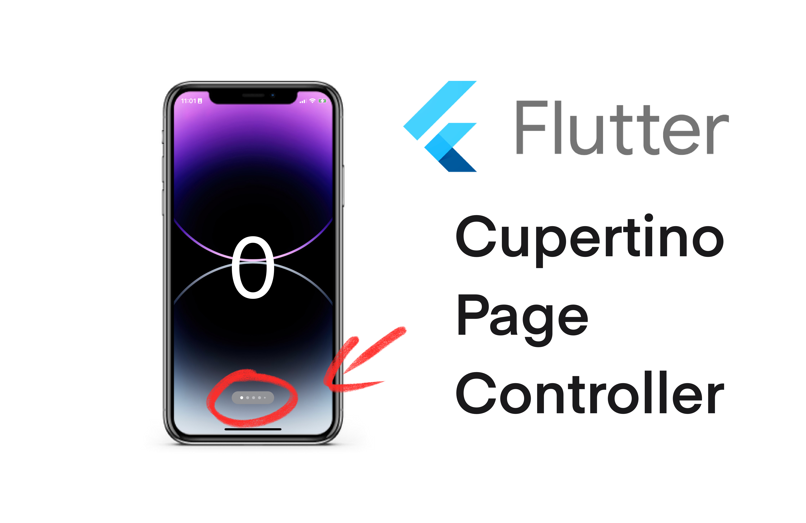
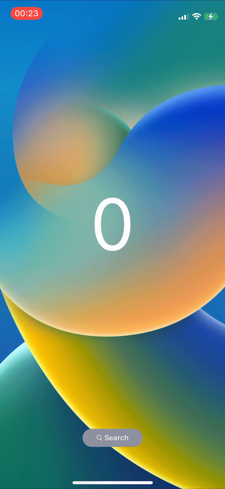

<a href=""></img></a>

### Demo Preview

| Unlimited Index          | 5 Index               | 2 Index                |
|-----------------------|-----------------------|-----------------------|
|  |  |  |


The `cupertino_page_controller` package allow you to display an controller in order to check your current index inside a list

### Features

- Display index of list
- Optionnaly add function to tap and redirect to a page
- Choose dark or ligth mode

⭐️ Feel free to stars the project if you like it and increase the SEO of this package! ⭐️

#### Installation

Click here: <a href="https://pub.dev/packages/cupertino_page_controller">Pub dev</a>

Add the following dependency to your pubspec.yaml file:

```
dependencies:
    cupertino_page_controller: ^0.0.1
```

Then, run `flutter pub get` to fetch the package.

#### Usage

- import the iphone package: `import 'package:cupertino_page_controller/cupertino_page_controller.dart';`

#### cupertino_page_controller Color (optinal)

- brightness: Brightness (optional) to choose theme of widget

```
brightness: Brightness.dark,
```

#### Length of the list

- length: int (required) to bring the length of the list

```
length: 10,
```

#### Other propriety

- name: String (optional) title of the widget
- icon: IconData (optional) icon at the left
- function: Function (optional) when tap on the widget and route


```
name: "Search",
icon: CupertinoIcons.search,
function: () {
    // Do something like route..
},
```

#### Track Index Animation

Add this variable that will change when you change to a new element of list, this will allow to track the current dot in white and the 2 other variable will `Timer _timer` and `bool isSelect` will allow to create a custom animation transition between "search mode" and dot controller: (required)

```
current: current,
isSelect: isSelect,
timer: _timer,
```

❤️
